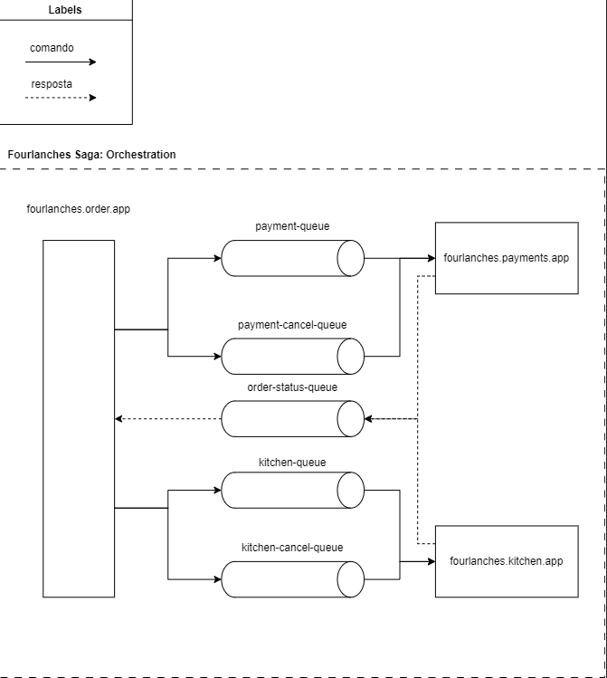
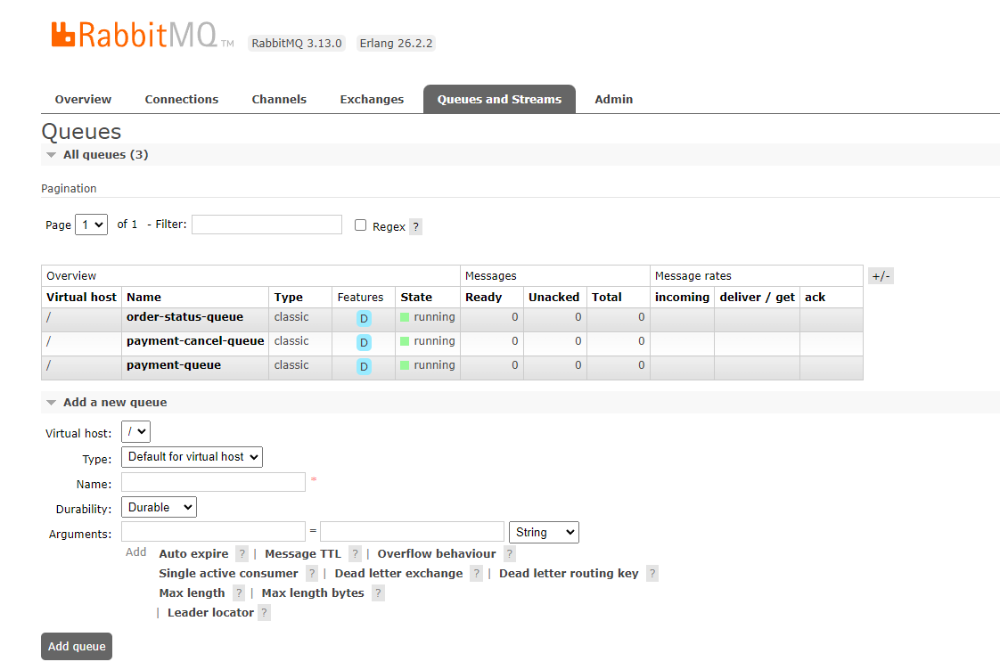
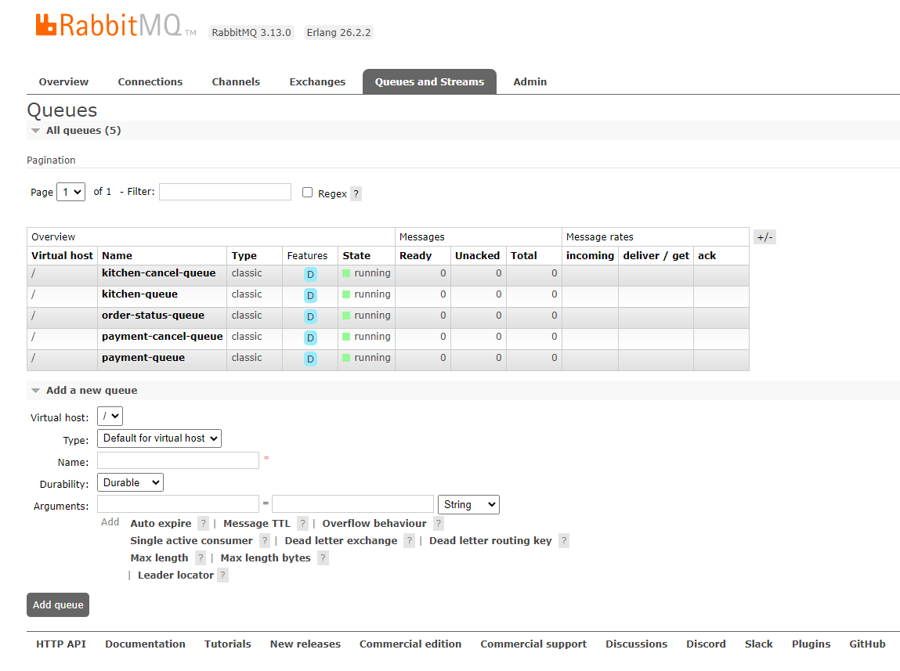
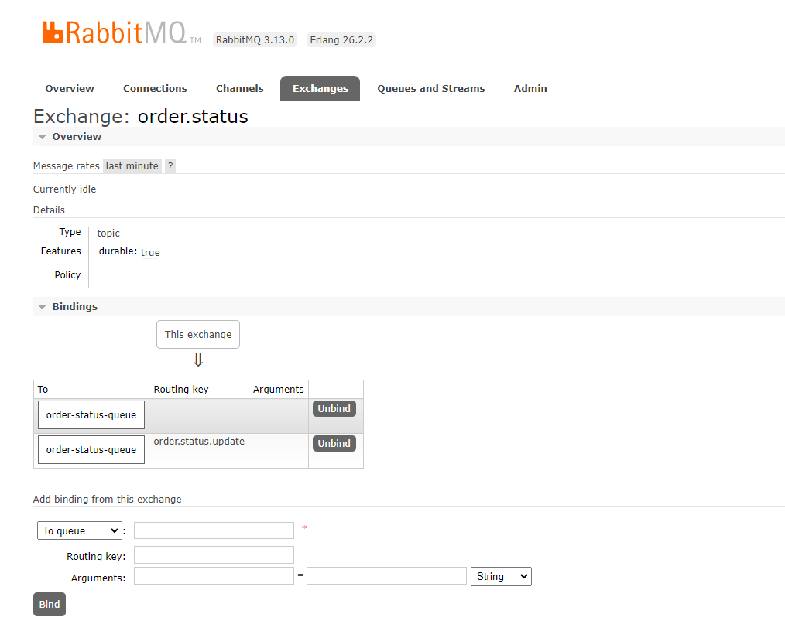

# Repositório de Demonstração da SAGA.

## 1. SAGA Orquestrada

Ao escolher aplicar o padrão SAGA em nossos microsserviços, validamos ambas configurações: coreografado e orquestrado.
Para nós, a SAGA coreagrafada faz mais sentido pela forma em que os domínios foram modelados. O serviço orquestrado é o 
order.app (serviço de pedidos), justamente pelo fluxo se iniciar e finalizar nele, bem como o mesmo precisa saber como
se decorreu o pagamento do pedido ou a produção do pedido na cozinha. Porém, o serviço de pagamento (payments.app) não
precisa saber de nada da cozinha, e a cozinha/produção (kitchen.app) não precisa saber de nada do pagamento.

Desta forma, mesmo o controle ficando centralizado, a aplicação está altamente escalável e expansível, permitindo a entrada
de novo serviços para a saga se necessário.

## 2. Para executar localmente com Docker
### 2.1. Necessário um arquivo .env na raiz do projeto com a seguinte conteúdo:

Para executar localmente com o docker é necessário fazer uma cópia do arquivo .env.example, renomear a
cópia para .env e configurar as variavéis de acordo com o ambiente. O arquivo de exemplo já consegue ser utilizado para
subir as aplicações.

#### 2.2. Para os apps no docker 

`docker compose --env-file .env up -d`

### 2.3. Preparando o RabbitMQ
Após subir todos os containeres necessários, é necessário validar se todas as filas e exchange abaixo estão criados. Se
Não estiverem criadas, basta criar o que estiver faltando. Para acessar o rabbitmq, basta  acessar o rabbitmq em `localhost:15672`
(configuração padrão) com  usários e senha configurados no arquivo `.env.`

Exemplo de filas faltando no rabbitmq.

Exemplo de filas completas no rabbitmq.

Exemplo de exchange corretamente configurado no rabbitmq.

## 3. Testando
Basta acessar a url do swagger disponivel em `http://localhost:{port}/swagger-ui/index.html`. Caso não tenha sido modificado
as portas do docker-compose, as aplicações estarão disponíveis nos seguintes swaggers:
- Order: http://localhost:8080/swagger-ui/index.html
- Payment: http://localhost:8081/swagger-ui/index.html
- Kitchen: http://localhost:8082/swagger-ui/index.html

>Nota para executar o localmente  pelo Docker
>Subindo as aplicações via docker, as mesmas se encotraram disponíveis no localhost:{port} para ser acessada de acordo
>com a porta configurada no arquivo docker-compose.
